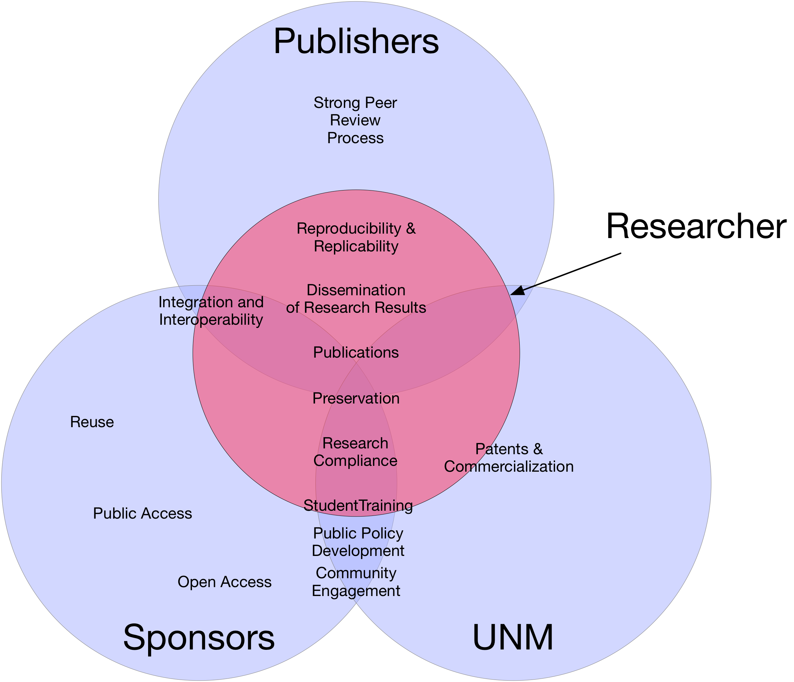

# Who Owns My Data?

Who (besides me) has an interest in my data?

##  Competing and Conflicting Interests

The following table is adapted from discussion in Briney, Goben, and Zilinski (2017).

|| **Stakeholder** | **Example Policy** | **Coverage** |
| ----------- | -------------- | -------- |
| Institution | [E70: IP](http://handbook.unm.edu/policies/section-e/e70.html) | Data ownership, stewardship, retention |
| Funders     | [NSF](https://www.nsf.gov/bfa/dias/policy/dmp.jsp) | Data management, sharing, open access |
| Publishers  | [PLOS ONE](http://journals.plos.org/plosone/s/data-availability) | Reproducibility of results, open access |

## References

1. Briney, K., Goben, A., & Zilinski, L.. (2015). Do You Have an Institutional Data Policy? A Review of the Current Landscape of Library
Data Services and Institutional Data Policies. Journal of Librarianship and Scholarly Communication, 3(2), eP1232. DOI:
http://doi.org/10.7710/2162-3309.1232

2. Briney, K., Goben, A., & Zilinski, L. (2017). "Institutional, Funder, and Journal Data Policies." In Johnston, Lisa (Ed.), _Curating
Research Data: Volume One_. ACRL.